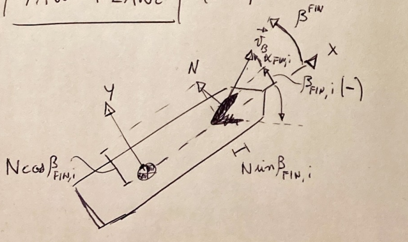
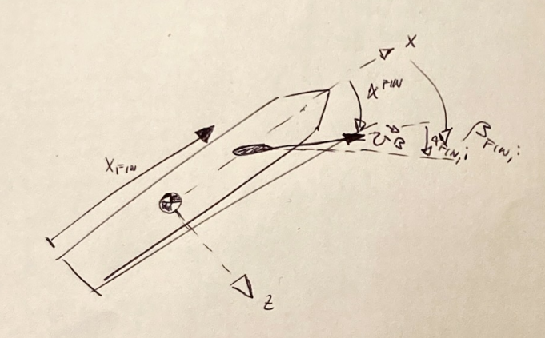

# RL_rocket
Repository for the development of my master thesis on control of launch vehicles descent and landing through reinforcement learning actors.

## 6DOF problem
In this repository a full 6DOF rocket landing environment is developed, with realistic dynamics equation modeled on a rigid body assumption.

### Continuous action space
The environment employes a continuous action space, with the engine allowed to throttle between `maxThrust` and `minThrust`. The thrust was normalized to lie in the range `[-1, +1]` as best practice for convergence of the algorithms suggest. The engine is gimbaled by two angles $\delta_y$ and $\delta_z$ around two hinge points, respectively moving the engine around the z and y axis.

# Thesis TOC

1. Overview of aerospace control techniques with AI
2. Advantages/Disadvantages of reinforcement learning
3. RL problem structure and algorithm used
4. Environments setup
    - 3DOF environment
    - 6DOF environment
    - Software architecture implementation
5. Different reward functions definitions
6. Results in 3DOF
7. Results in 6DOF

# Docker
To run the algorithm in a Docker container follow these steps:
1. Clone the repository

2. Build the docker image `docker build -t rl_rocket_docker .`
3. Get your Wandb API key from [wandb.ai/authorize](https://www.wandb.ai/authorize)
4. Start the docker container passing the API key as an environmental variable (paste it in place of `$YOUR_API_KEY$`)
`docker run -e WANDB_API_KEY=$YOUR_API_KEY$ -it rl_rocket_docker`

## Aerodynamic fins control

Research question:
*   Is there a reduction in fuel consumption when the thruster is aided by fins? Quantify it.

### Actuator description

*   Yaw plane ( `x` - `y` ) corresponding to `i={3,4}`:
    * Diagram of the angles 

    * Position vector of the fin `i` in body coordinates:
        $$\vec{x}^{B,i} = 
        \begin{bmatrix}
            x_{fin}^i \\ 0 \\ \pm r_{base}
        \end{bmatrix}$$

*   Pitch plane ( `x` - `z` ) corresponding to `i={1,2}`:
    * Diagram of the angles 

    * Position vector of the fin `i` in body coordinates:
        $$
        \vec{x}^{B,i} = 
        \begin{bmatrix}
            x_{fin}^i \\ \pm r_{base} \\ 0
        \end{bmatrix}
        $$
### Actuator control definition (`x`-`y`)
To compute the force generated by the fin `i` in body axis we have to:

1.  Neglecting wind, we can compute the air velocity of the center of mass of the vehicle as: 

    $$ \vec{v}^B_{air} = R_{I \rightarrow B}\vec{v}^I$$

1.  Compute the velocity vector at each fin location `i` (denoted by its `position vector` in body coordinates $\vec{x}^{B,i}$), taking into account the rotation of the rocket:

    $$ \vec{v}^{B,i}_{air} = \vec{v}^B_{air} + \vec{\omega}^B \times \left[ \vec{x}^{B,i} - \vec{x}^{B,CG}\right]$$

1.  Compute the *aerodynamic angles* at the location of each fin `i`:

    *   `x`-`z` plane aerodynamic angle:
    
        $$\alpha^i = \arctan 2 \left[ \frac{v_z^{B,i}}{v_x^{B,i}} \right]$$

    *   `x`-`y` plane aerodynamic angle:

        $$\beta^i = \arcsin \left[ \frac{v_y^{B,i}}{||\vec{v}^{B,i}||} \right] $$

1.  **Input** the *angle of deflection from the longitudinal axis* of the fin $\beta_{fin,i}$ (i.e. the **control input**).

1.  Compute the *angle of attack* $AoA$ of each fin `i`:
    
    *   Yaw plane ( `x` - `y` ):
        $$AoA_i = -\beta_{fin,i} - \beta^i$$
        
    *   Pitch plane ( `x` - `z` ):
        $$AoA_i = \beta_{fin,i} - \alpha^i$$

1.  Compute the *aerodynamic pressure* $$q=\frac{1}{2}\rho(x)||\vec{\vec{v}^{B,i}_{air}}||$$

1.  Compute the *normal force coefficient* $C_f$:

    $$ C_f(AoA_i)=\bar{C_f} \sin{AoA_i} $$

1.  Compute the aerodynamic force at each fin `i`:

    *   Yaw plane ( `x` - `y` ):

        $$ \vec{F}^B_{fin,i} = qS_{fin}C_f\left(AoA_i\right)
        \begin{bmatrix}
        \sin{\beta_{fin,i}} & \cos{\beta_{fin,i}} & 0
        \end{bmatrix}^T$$
        
    *   Pitch plane ( `x` - `z` ):
        
        $$ \vec{F}^B_{fin,i} = qS_{fin}C_f\left(AoA_i\right)
        \begin{bmatrix}
        -\sin{\beta_{fin,i}} & 0 & \cos{\beta_{fin,i}}
        \end{bmatrix}^T$$

1.  Compute the aerodynamic *torque* for each fin `i`:

    $$ M^i = \left[ \vec{x}^{B,i} - \vec{x}^{B,CG}\right] \times \vec{F}^B_{fin,i} $$

